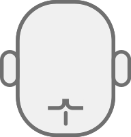
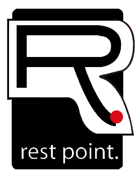
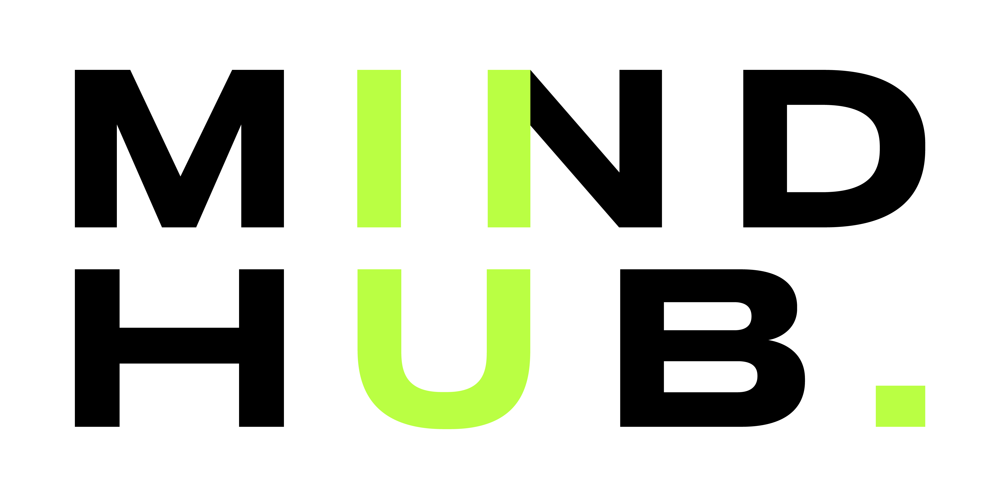

# ¡Hola :wave:! Soy **Branko**.
---

##  Bio. </h2>

Apasionado por la tecnología desde que tengo memoria, gran parte de la infancia la pasé jugando con Legos, cables, baterías, motores y leds.

En 2006 egresé del secundario con el título de técnico en electrónica y comencé a trabajar realizando tareas de soporte técnico de informática.

Buscando generar herramientas que facilitaran las tareas de mis clientes, descubrí que la programación me resultaba súper interesante. Es así como comencé a aprender de manera autodidacta desarrollo Web (HTML, CSS, JS), PHP y Java .

A principios de 2019 concursé por una beca para un Bootcamp de desarrollo Fullstack, quedando dentro de los 200 seleccionados de entre más de 4000 aspirantes. 

En 2020 comencé a desempeñarme como Mentor Jr. en Bootcamps de desarrollo Frontend, lo que me permitió forjar relaciones, afianzar conocimientos y mejorar mi metodología de trabajo.

---
---

## :link: Mis redes:

<!-- ~~www.branko.com.ar~~ (En construcción) -->

[ YouTube](https://youtube.com/brankoh "Acá subo mis tutoriales")

[ LinkedIn][linkedin]

[:envelope: hola@branko.com.ar](mailto:hola@branko.com.ar)

---
---

## :computer: Trabajos destacados:

Restpoint Argentina

Fundador | 2009 - presente

Reparación de equipos informáticos, celulares, monitores. 

Soporte técnico de redes, software y hardware.

https://www.restpoint.com.ar
 

Mindhub

Mentor FrontEnd | 2020 - presente

Dictado de workshops y acompañamiento de los alumnos a lo largo de la cursada.

Junto con mi colega recopilamos algunos ejemplos utilizados en clase para que los alumnos los tengan al alcance de la mano:

https://brankohbk.github.io/snippets/
 

---
---

## ¡Gracias por visitar mi perfil!

Como recompensa, acá dejo un pequeño [:video_game: videojuego][webario] para pasar el rato.

---

<h2 align="center">:raised_hands: ¡Hasta pronto!</h2>

  

<!-- Referencias -->
[linkedin]: https://www.linkedin.com/in/branko-haberkon/
[webario]: https://brankohbk.github.io/webario/index.html
